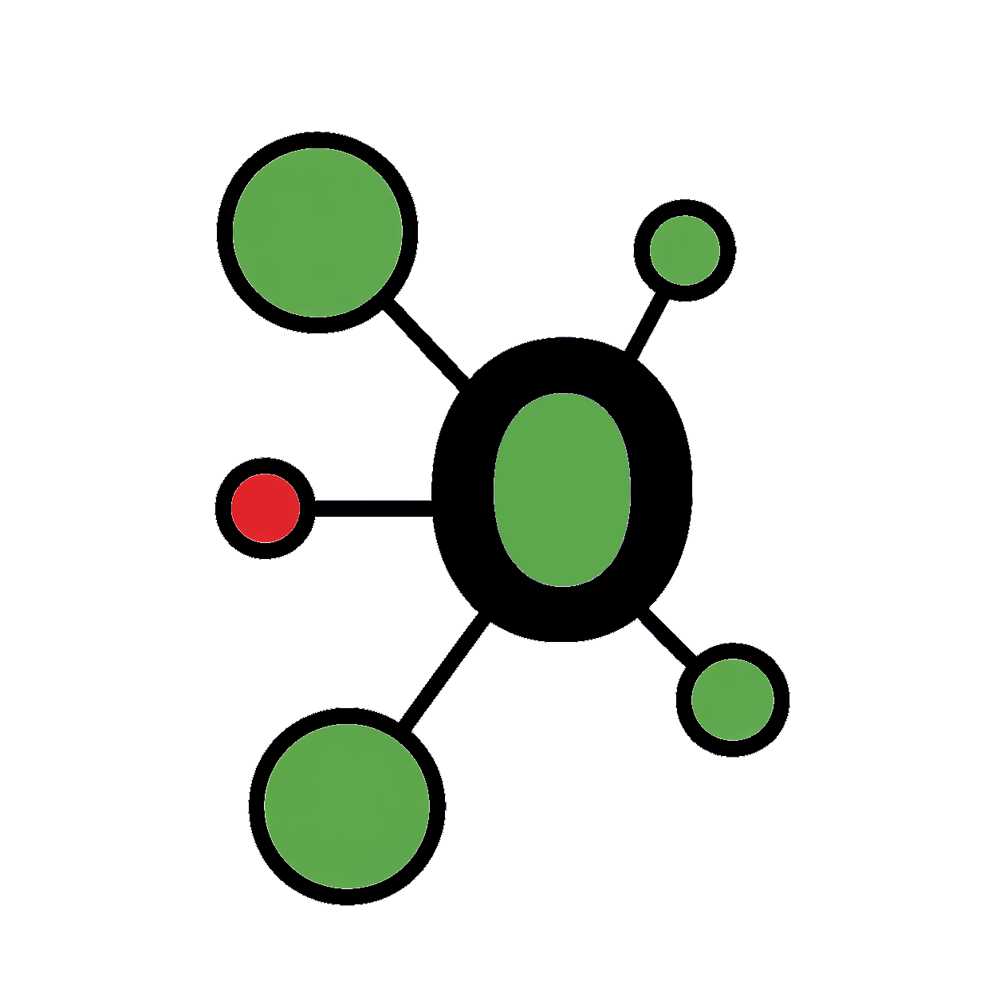
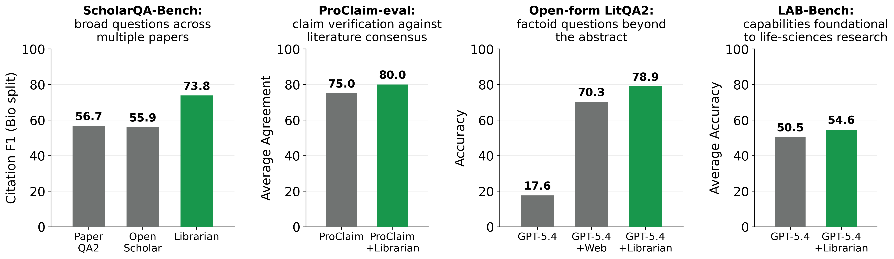
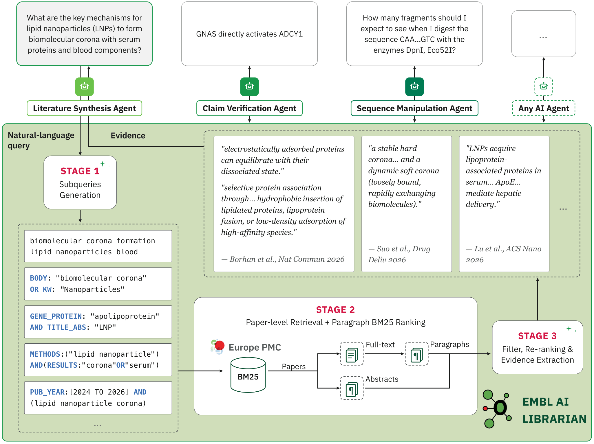

<div align="center">



<h1><span style="color:#18974C">EMBL AI Librarian</span></h1>

<h3>A life-sciences knowledge layer for AI agents</h3>

<!-- TODO: project page, once one exists
<h4><a href="https://your-project-page.example">Project Page 🚀</a></h4>
-->

<!--
  TODO: capture a real run and drop it here as assets/demo.gif or assets/teaser.png
  (e.g. a terminal recording of `uv run main.py "<question>"` showing the spinner
  stages and the final ranked evidence passages).
-->
<!--  -->

[](https://arxiv.org/abs/2607.28229)
[](https://www.python.org/)

[](LICENSE)
[-0A5032.svg)](https://europepmc.org/)
[](#-contributing)
[](https://github.com/petroni-lab/librarian/stargazers)


<h5>If EMBL AI Librarian is useful to you, please consider giving it a ⭐</h5>

</div>

---

## 🛠️ Installation

**Prerequisites:** Python 3.10+

The project is managed with [uv](https://docs.astral.sh/uv/). First install uv itself:
```bash
curl -LsSf https://astral.sh/uv/install.sh | sh
```

Then clone the repo. A single `uv sync` creates the virtual environment (fetching a
compatible Python if needed) and installs every dependency:
```bash
git clone https://github.com/petroni-lab/librarian.git
cd librarian
uv sync
```

## ▶️ Quickstart

The agent needs an OpenAI-compatible LLM endpoint (a self-hosted vLLM server or a remote
provider). Configure it in a `.env` file — copy the template and edit:

```bash
cp .env.example .env
# then edit .env:
#   LLM_BASE_URL=http://localhost:8000/v1
#   LLM_MODEL=your-model-name
#   LLM_API_KEY=EMPTY   # or your provider key

uv run main.py "does metformin extend lifespan in mammals?"
```

`main.py` loads `.env` automatically. You can also just export the same three variables
in your shell.

> **Reproducing the paper's numbers.** All reported results use **GLM-5**
> (`glm-5-fp8`), self-hosted on an NVIDIA DGX B200 and served through
> [vLLM](https://github.com/vllm-project/vllm), for every LLM stage: subquery planning,
> relevance filtering, and synthesis. Librarian is model-agnostic and runs with any
> OpenAI-compatible endpoint, but smaller or weaker models will produce noticeably
> different evidence quality — the planner in particular has to emit valid Europe PMC
> fielded syntax. See [⚙️ Configuration](#️-configuration) for the exact retrieval
> settings used in all experiments.

On a terminal you'll see a live spinner reporting the current stage (`Searching Europe
PMC`, `Found 210 candidate paragraphs`, `Judging paragraph relevance · 6/8 batches`, ...)
so you can tell how far along a run is. When the output is piped/redirected the spinner
is skipped and the agent prints plain `[Librarian]` log lines instead.
`LibrarianAgent.run()` accepts an `on_progress=callable` hook if you want to drive your
own UI, and a `tracer=` hook (see [`tracing_port.py`](librarian/tracing_port.py)) if you
want to wire span tracing into your own backend.

### Serving it over HTTP

`orchestrator.py` is a minimal FastAPI wrapper around the same agent:

```bash
uv run --extra api uvicorn orchestrator:app --port 8080

# blocking JSON
curl localhost:8080/run-agent -H 'content-type: application/json' \
    -d '{"query": "does metformin extend lifespan in mammals?"}'

# same run, streamed: one `progress` event per pipeline stage, then `result`
curl -N localhost:8080/run-agent/stream -H 'content-type: application/json' \
    -d '{"query": "does metformin extend lifespan in mammals?"}'
```

Both endpoints take `{"query": ..., "full_text_enrichment": true}` and return the query,
the planner's sub-queries, and the ranked evidence passages. `GET /health` is the
liveness probe; interactive docs are at `/docs`.

---

## 📰 News

* **[2026.09.03]** Retrieval pipeline rework: paragraph-level pooling across
  sub-queries, a single relevance judge (replacing the two concurrent
  full-text/abstract judges), snippet-level citations, author affiliation,
  uncapped per-paper evidence, and an optional `tracer=` span-tracing hook.
  See [⚙️ Configuration](#️-configuration) — several knobs changed with it.
* **[2026.07.31]** Preprint available on arXiv.
* **[2026.07.30]** Initial release of the EMBL AI Librarian agent and retrieval pipeline.

---

## 😮 Highlights

### 🗣️ Natural language in, ranked evidence out

Europe PMC and similar resources were not built for AI agents: they take keywords and
complex query syntax and return whole papers, so every agent has to learn the syntax,
issue several searches, and read full papers just to find the evidence it needs.
**EMBL AI Librarian** upgrades that interface — an agent asks a question the way a person
would, and gets back the passages that answer it, each paired with citation metadata and
the Europe PMC query that retrieved it.

### 🧭 No index to maintain: one planning call, deterministic retrieval, one judging pass

Librarian keeps no dense vector index of its own — it queries Europe PMC's live search
directly. One LLM call plans complementary sub-queries; everything in between is
deterministic and cheap (query validation, search, full-text fetch, BM25 paragraph
ranking, hierarchical dedup). A single batched LLM pass then filters, re-ranks, and
extracts the final evidence sentences.

### 📈 Consistent gains across four benchmark suites

Equipping life-science agents with the Librarian knowledge layer helps on all four
suites we evaluate:

| Benchmark | Metric | Baseline | + Librarian |
|---|---|---|---|
| ScholarQA-Bench (Bio) | Citation F1 | 56.7 (PaperQA2) / 67.0 (same agent, BM25 on OSDS) | **73.8** |
| ScholarQA-Bench (Neu) | Citation F1 | 63.1 (OpenScholar-70B) / 68.5 (same agent, BM25 on OSDS) | **79.4** |
| ProClaim-eval | Agreement w/ expert consensus | 0.75 | **0.80** |
| Open-form LitQA2 | Accuracy | 70.3 (GPT-5.4 + web search) | **78.9** |
| LAB-Bench | Macro accuracy (GPT-5.4) | 50.5 | **54.6** (+11.3 on SeqQA) |

> **Note:** the numbers above are from the pipeline described in the paper (paper-level
> pooling, two concurrent relevance judges, capped evidence). The retrieval pipeline has
> since been reworked (see [📰 News](#-news)) and these numbers are pending
> re-validation against the current single-judge, paragraph-pooled pipeline.

Two comparisons matter and they answer different questions. Against **strong published
baselines**, Librarian is more than **+16 Citation F1** on ScholarQA-Bench — but part of
that gap comes from our synthesis agent's larger backbone (GLM-5, ~700B, vs. ~70B),
not from retrieval. The controlled comparison — same agent, same prompt, swapping a BM25
index over the OpenScholar Data Store for Librarian — isolates the knowledge layer and
gives **+6.8 Bio / +10.9 Neu**. See the paper for the full evaluation and ablations.

---

## 🚀 Main Results

<!--
  TODO: drop in a real benchmark chart, e.g. assets/results.png —
  bar chart of Citation F1 / LitQA2 accuracy vs. baselines.
-->
<div align="center"></div>

---

## 🔄 Pipeline Overview

`LibrarianAgent.run(query)` is a single pass (`librarian/agent.py`):

<div align="center"></div>


<details>
<summary><b>Stage 1: Subqueries Generation</b></summary>

The LLM turns the question into up to N complementary Europe PMC sub-queries
(`prompts/europepmc_claude_librarian.md`). Each sub-query is checked by a deterministic
syntax validator (`query_validation/`, pure parsing — no LLM call); invalid field names
and malformed Boolean expressions are rejected.

Two conservative fallbacks guard the degenerate cases:

- **Planner output unparseable** — retried once at temperature 0 with a strict-JSON
  instruction. If that also fails, the raw user query is used as the single search query.
- **Every sub-query rejected by the validator** — the planned sub-queries are searched
  unmodified, so a validator false positive can never empty the search plan. (The raw
  user query is *not* substituted in this case.)

</details>

<details>
<summary><b>Stage 2: Per-sub-query Retrieval + Paragraph BM25 Ranking</b></summary>

Validated sub-queries run in parallel — one thread per sub-query, capped at the CPUs
actually available (reading the container's cgroup CPU quota when present, so a large
sub-query count can't oversubscribe a small container).

Each sub-query searches the live Europe PMC service (up to `papers_per_subquery`
records), and every returned paper is decomposed into paragraph records: its abstract,
plus — for open-access papers — its full-text body paragraphs (JATS XML fetched by
PMCID, `literature_search.py` + `jats.py`). Paragraphs longer than
`max_paragraph_words` are split into overlapping word windows so a long paragraph
can't out-rank a short one on length alone. Every record's BM25 document mixes in its
section title/type and the paper's own metadata (title/authors/journal/year on the
abstract, year only on body chunks, so a query naming an author or year still matches
without letting metadata dominate every one of a paper's chunks) plus optional
Snowball stemming (`LITERATURE_BM25_STEMMING=0` to disable).

Each sub-query's paragraphs are BM25-ranked against *that sub-query's* text and the
top `paragraphs_per_subquery` are kept. Because complementary sub-queries often surface
the same or overlapping paragraphs, the per-sub-query pools are then merged: identical
or overlapping selections from the same source paragraph are unioned into one record,
so a paragraph relevant to several sub-queries costs the downstream judge budget once.

</details>

<details>
<summary><b>Stage 3: Single-pass Relevance Judge & Evidence Extraction</b></summary>

The merged paragraph pool is segmented into sentences with pySBD, each given a stable
identifier, and judged in batches of `paragraphs_per_judge_batch` paragraphs
(`prompts/relevance_filter.md`). One LLM call returns an ordered list of sentence
identifiers, which simultaneously filters irrelevant paragraphs, re-ranks the relevant
ones, and extracts the supporting sentences. Cited sentences are grouped by paper into
contiguous evidence spans (`evidence_snippets`) in reading order — a paper whose cited
sentences aren't adjacent yields more than one span rather than one string silently
splicing distant sentences together. There is no cap on evidence length per paper: the
judge's own citation decision is the only filter.

A malformed or truncated judge reply is not discarded outright: ids are salvaged from
the raw text where possible, and an unparseable batch is split and retried (up to two
levels) before giving up on it. Papers the judge never cites are dropped; there is no
final `top_k` cap layered on top of the judge's own decision.

</details>

The result is a list of passage dicts:

```python
{
  "evidence_snippets": ["...cited sentence span...", ...],
  "paper_id": "12345678",
  "title": "...", "authors": "...", "journal": "...", "year": "2023",
  "pmid": "12345678", "doi": "10.xxxx/...", "epmcId": "...", "epmcSource": "MED",
  "url": "https://europepmc.org/article/...", "affiliation": "...",
  "has_fulltext": True,
}
```

---

## ⚙️ Configuration

Defaults live in `librarian/config.py`, and are identical to the settings used in every
experiment reported in the paper. A few knobs can be overridden via env vars without
editing code:

| Env var | Default | Meaning |
|---|---|---|
| `LITERATURE_MAX_QUERY_COUNT` | 7 | max sub-queries generated |
| `LITERATURE_PAPERS_PER_SUBQUERY` | 50 | Europe PMC results fetched per sub-query |
| `LITERATURE_PARAGRAPHS_PER_SUBQUERY` | 16 | top-BM25 paragraphs kept per sub-query |
| `LITERATURE_PARAGRAPHS_PER_JUDGE_BATCH` | 128 | paragraphs per Stage-3 LLM call |
| `LITERATURE_MAX_PARAGRAPH_WORDS` | 250 | window size before a long paragraph is split |
| `LITERATURE_PARAGRAPH_OVERLAP_WORDS` | 50 | overlap between adjacent split windows |
| `LITERATURE_BM25_STEMMING` | on | Snowball stemming for BM25 (`0` to disable) |
| `LITERATURE_FILTER_TEMPERATURE` | 0.1 | relevance-judge temperature |

`paragraphs_per_judge_batch` should be `>= paragraphs_per_subquery * max_query_count`
so the whole pool is judged in one call — the judge ranks globally, but results from
several batches are only concatenated in batch order, so a smaller value silently
degrades the ranking to per-batch. Raise all three knobs together.

---

## 📁 Layout

```
pyproject.toml                 project metadata + dependencies (managed by uv)
main.py                        CLI entrypoint
orchestrator.py                minimal FastAPI server (blocking + SSE endpoints)
librarian/
  agent.py                     the retrieval pipeline (start here)
  config.py                    tuning knobs (env-var overridable)
  tracing_port.py              TracingPort protocol + no-op default (optional tracer=)
  llm_client.py                minimal OpenAI-compatible client
  literature_search.py         Europe PMC search
  jats.py                      JATS full-text XML -> body paragraphs
  progress.py                  stdlib terminal spinner for live progress
  prompts/                     query planner + relevance-judge prompts
  query_validation/            deterministic Europe PMC query validation
```

---

## ⚠️ Scope & Limitations

Worth knowing before you plug Librarian into a pipeline:

- **Coverage is bounded by Europe PMC.** The full text of paywalled papers is not
  available; those records contribute their abstract only. Extending coverage to other
  EMBL resources (OpenTargets, UniProt, ChEMBL) is planned.
- **Single retrieval round.** Librarian issues multiple complementary sub-queries to
  improve recall, but it does not loop. Multi-hop questions are left to the downstream
  agent. Letting Librarian decide whether to keep searching is future work.
- **Text only.** Figures and supplementary material are ignored, and tables are handled
  as text, so evidence living in those places is currently inaccessible. This is why our
  LAB-Bench evaluation excludes FigQA, TableQA, and SuppQA.
---

## 🤝 Contributing

Issues and pull requests are welcome.

---

## 📄 Citation

If you use EMBL AI Librarian in your research, please cite:

```bibtex
@misc{sigillo2026emblailibrarianlifesciences,
      title={EMBL AI Librarian: Life-Sciences Knowledge Layer for AI Agents}, 
      author={Luigi Sigillo and Matteo Silvestri and Francesco Tabaro and Rajat Bhatnagar and Syed Irtaza Mubashar and Matt Jeffryes and Daljit Nijjer and Vittorio Perera and Ola Spjuth and Julio Saez-Rodriguez and Melissa Harrison and Fabio Petroni},
      year={2026},
      eprint={2607.28229},
      archivePrefix={arXiv},
      primaryClass={cs.CL},
      url={https://arxiv.org/abs/2607.28229}, 
}
```

---

## 🙏 Acknowledgements

We thank the maintainers of:

- **[Europe PMC](https://europepmc.org/)** — the literature search and full-text API this project builds on
- **[uv](https://docs.astral.sh/uv/)** — Python packaging and environment management
- **[bm25s](https://github.com/xhluca/bm25s)** — fast BM25 paragraph ranking
- **[pysbd](https://github.com/nipunsadvilkar/pySBD)** — sentence boundary detection for evidence extraction

---

## 🌟 Star History

<!-- NOTE: the sealed_token below is embedded in a public file — confirm with
     star-history what it grants before leaving it in the repo. -->

<a href="https://www.star-history.com/?repos=petroni-lab%2Flibrarian&type=date&legend=top-left">
 <picture>
   <source media="(prefers-color-scheme: dark)" srcset="https://api.star-history.com/chart?repos=petroni-lab/librarian&type=date&theme=dark&legend=top-left&sealed_token=7YgSzSG-SjWbF5xWHHCFQtFqKLapQcVuOL42QMnicXID2d2AbFdS_vqV8pxk-39o8e-i4oeUzGYgEYi2iYQJHVxVVCKGohjFjutFhp25g23bUxe7gZ9LbhXfaB0_AlK5x3pig7NRcSuM_545_CQCKU4zdLXdbRX8bnLwhTPoNO_gF0wTkS2a9ZgMzpGh" />
   <source media="(prefers-color-scheme: light)" srcset="https://api.star-history.com/chart?repos=petroni-lab/librarian&type=date&legend=top-left&sealed_token=7YgSzSG-SjWbF5xWHHCFQtFqKLapQcVuOL42QMnicXID2d2AbFdS_vqV8pxk-39o8e-i4oeUzGYgEYi2iYQJHVxVVCKGohjFjutFhp25g23bUxe7gZ9LbhXfaB0_AlK5x3pig7NRcSuM_545_CQCKU4zdLXdbRX8bnLwhTPoNO_gF0wTkS2a9ZgMzpGh" />
   
 </picture>
</a>

---

## 📝 License

Released under the MIT License. See [LICENSE](LICENSE) for details.